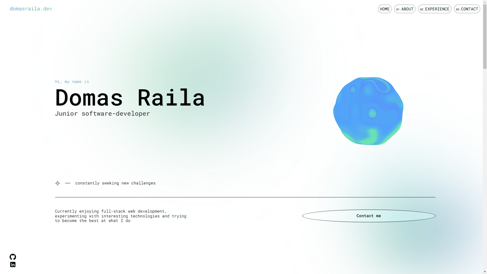

# Portfolio website

Personal web development portfolio website built with [React](https://react.dev/), [Typescript](https://www.typescriptlang.org/) and hosted with [Netlify](https://www.netlify.com/).
And also a few other dependencies used like [Three.js](https://github.com/mrdoob/three.js), [MaterialUI](https://mui.com/) and [GSAP](https://gsap.com/). As of 2023-17-10 this repo contains 2,815 lines of code.

[](https://domasraila.dev/)

To start locally run:

```bash
npm i
```

```bash
npm start
```

**💡 Technical notes -**

- Some of the css variables used through the app are defined in the Main.css file. And some of the gsap configuration in the gsap.ts file.
- The sphere model has custom shaders written in GLSL, the webpack config is modified using
  craco without ejecting the app, so that .glsl files are compiled properly.

Initially was meant to take less time than it took but I ended up experiementing with new technologies and css features I never used. Enjoy!
